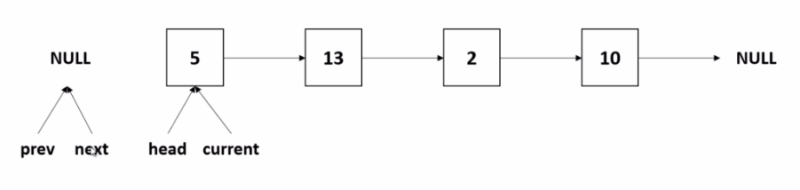
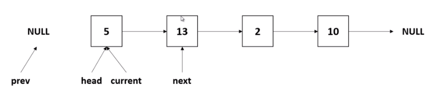
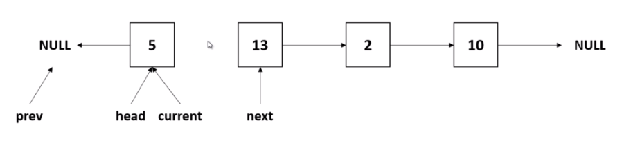
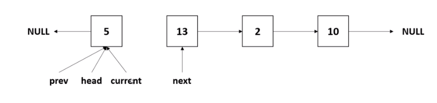
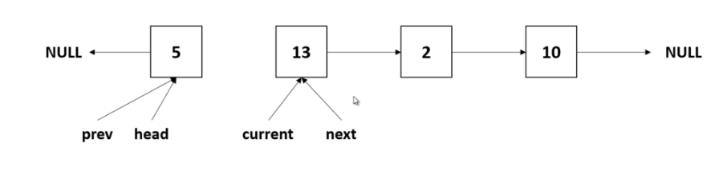

# Linked List (연결 리스트)
## 1. 정의
- Linked List는 동적 메모리 할당을 이용해 리스트를 구현하는 가장 간단한 형태의 자료구조이다.
- 동적 메모리를 할당받아 노드를 저장하고 노드는 참조를 이용하여 다음 노드를 가리키도록 만들어 노드들을 한 줄로 연결한다.
- 하나의 노드는 integer, double, custom object와 같은 데이터를 포함하고 있으며 다음 노드를 가리키는 참조변수를 포함하고 있다.

### 구성
- Linked List의 노드는 데이터와 참조값으로 구성되는데 참조값은 한 노드에서 다른 노드를 가리키는 포인터 역할을 한다. 그리고 마지막 참조값은 null을 가리키게 된다.
### 특성
- Linked List는 단순하고 매우 일반적인 데이터 구조로 Stack, Queue 등의 다른 일반적인 데이터 유형을 구현하는 데 사용할 수 있다.
- Linked List 자체로는 데이터에 대한 랜덤 액세스를 허용하지 않으므로 인덱스를 사용할 수 없다.
- 리스트의 마지막 노드를 가져오거나, 지정된 데이터가 들어 있는 노드를 찾거나, 새 노드를 삽입할 위치를 찾는 등의 많은 기본 작업을 수행하려면 대부분 또는 전체 리스트의 요소를 순차적으로 검사해야만 한다.

## 2. 장점
- 배열과 다르게 연결리스트는 동적 자료구조이기 때문에 런타임 시에 필요한 메모리를 할당할 수 있다.
- 첫번째 요소 조작에 매우 효율적이다.
- 구현이 간편하다.
- 크기가 서로 다른 요소를 저장할 수 있다.

## 3. 단점
- 참조로 인해 메모리 낭비가 된다.
- 연결리스트는 항목을 탐색하려면 항상 첫 노드부터 원하는 노드를 찾을 때까지 차례로 방문하는 순차 탐색을 해야 한다.
- 역방향 이동에는 제약이 발생하기 때문에 이중 연결리스트를 구현해야 하고, 이렇게 되면 이전 노드의 참조가 필요하게 됨으로 메모리가 추가적으로 필요하게 된다.

## 4. 연산
### 1) 맨 앞 노드 삽입
- Linked List에 새로운 노드를 맨 앞에 삽입하는 방법은 새로운 노드의 참조값을 첫 노드로 변경하기만 하면 된다.

### 2) 맨 뒤 노드 삽입
- Linked List에 새로운 노드를 맨 마지막에 삽입하는 것은 비교적 간단하지는 않다.
- 연결리스트의 첫 번째 노드부터 마지막 노드(참조값이 null인 노드)까지 탐색을 한 뒤 마지막 노드의 참조값을 새로운 노드로 변경하고, 새로운 노드의 참조값을 null을 가리키게 하면된다.

### 3) 맨 앞 노드 삭제
- Linked List의 첫 노드는 매우 빠르게 제거할 수 있다. 노드를 추가적으로 탐색할 필요가 없으므로 참조값만 변경하면 된다.

### 4) 특정 데이터를 가진 노드 삭제
- 만약 특정 데이터를 가진 노드가 마지막에 존재한다면 첫 번째 노드부터 마지막 노드까지 탐색을 해야한다. (worst case)
- 특정 데이터를 가진 노드의 탐색을 완료한 뒤 특정 데이터를 가진 노드의 이전 노드가 다음 노드를 가리키도록 참조값을 변경해주면 된다.

## 5. Linked List vs Array
### 검색
- Array는 random access가 가능하기 때문에 Linked List보다 검색이 빠르다.
- Array는 index를 통해 검색하는 속도가 빠르지만, Linked List는 특정 요소를 검색하기 위해 모든 항목을 탐색해야만 한다.
### 삭제
- Linked List의 삭제 작업은 참조값을 변경하면 되기 때문에 Array보다 빠르게 수행이 가능하다.
- Array의 경우 삭제 작업을 할 때 배열을 재구성해야 하기 때문에 Linked List보다 상대적으로 느리다.
### 메모리
- Array의 경우 추가적으로 메모리가 필요하지 않다.
- Linked List는 참조값 때문에 추가적으로 메모리가 필요하다.

## 6. Linked List 구현
- src 참고.

## 7. 예시
### Linked List의 가운데 노드 찾기
#### 전략 1
- 두 개의 포인터를 사용한다.
- 첫 번째 포인터는 한 번에 한 노드씩 리스트를 탐색하고, 두번째 포인터는 한 번에 두 노드씩 리스트를 탐색한다.
- 두 번째 포인터가 마지막 노드에 도달했을 때 첫번째 포인터가 가리키는 노드가 가운데 노드이다.
```java
public Node<T> getMiddleNode() {

    Node<T> fastPointer = this.root;
    Node<T> slowPointer = this.root;

    // 마지막 노드까지 반복수행
    while (fastPointer.getNextNode() != null && fastPointer.getNextNode().getNextNode() != null) {
        fastPointer = fastPointer.getNextNode().getNextNode();
        slowPointer = slowPointer.getNextNode();
    }

    return slowPointer;
}
```

#### 전략 2
- 리스트를 반복하여 요소의 개수(count)를 세고, 그 다음 리스트를 count/2의 index를 가진  노드까지 탐색했을 때, 해당 노드가 가운데 노드이다.

### Linked List 역방향으로 변환
- 모든 노드를 하나씩 방문한 뒤 역순으로 Linked List를 구성하는 방법이 있는데 O(N) 공간복잡도를 가지기 때문에 적절한 해결책이 될 수 없다.
- 포인터를 사용한다.

<p align="center"></p>

```java
@Override
public void reverse() {
    Node<T> currentNode = this.root;
    Node<T> prevNode = null;
    Node<T> nextNode = null;

    // 마지막 노드까지 반복수행
    while (currentNode != null) {
        nextNode = currentNode.getNextNode(); // 현재 노드의 다음 노드를 다음 노드로 세팅
        currentNode.setNextNode(prevNode);    // 현재 노드의 다음 노드를 이전 노드로 변경 (역순으로 변경됨)
        prevNode = currentNode;               // 현재 노드를 이전 노드로 세팅
        currentNode = nextNode;               // 다음 노드를 현재 노드로 세팅
    }

    this.root = prevNode;
}
```

#### 1번
<p align="center"></p>

- 아래의 코드와 같이 현재 prevNode, nextNode는 null을 가리키고, currentNode는 Liked List의 head인 root를 가리키고 있다.
```java
Node<T> currentNode = this.root;
Node<T> prevNode = null;
Node<T> nextNode = null;
```

#### 2번
<p align="center"></p>

- while 반복문에서 첫 번째로 현재 노드(currentNode)의 다음 노드를 nextNode에 세팅한다.
```java
nextNode = currentNode.getNextNode(); // 현재 노드의 nextNode 세팅
```

#### 3번
<p align="center"></p>

- 현재 노드(currentNode)의 다음 노드(nextNode)를 이전 노드(prevNode)로 변경해준다. 이렇게 하면 역순으로 변경이 된다.
```java
currentNode.setNextNode(prevNode);    // 현재 노드의 다음노드를 이전 노드로 변경 (역순으로 변경됨)
```

#### 4번
<p align="center"></p>

- 이제 포인터를 뒤로 한 칸씩 이동시키기 위해 현재 노드(currentNode)를 이전 노드(prev)로 세팅한다.

<p align="center"></p>

- 그리고 나서 다음 노드(nextNode)를 현재 노드(currentNode)로 세팅한다.
