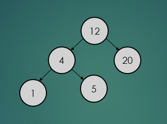
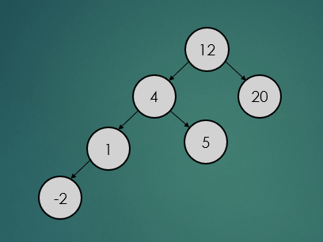
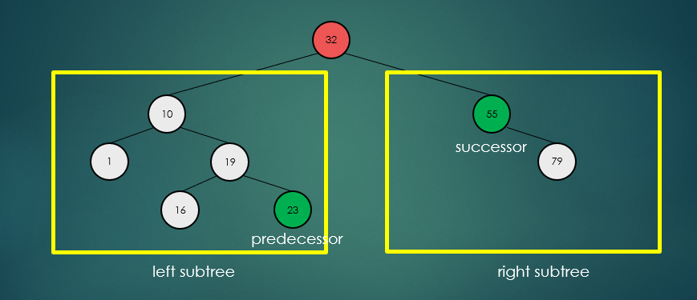
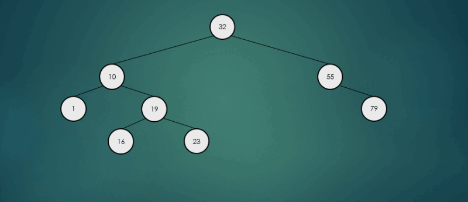

# Binary Search Tree (BST, 이진 탐색 트리)
## 1. 정의 및 특징
- 이진 탐색 트리는 이진 탐색의 개념을 트리 형태의 구조에 접목한 자료구조이다.

### 이진 탐색
- __정렬__ 된 데이터의 중간에 위치한 항목을 기준으로 데이터를 두 부분으로 나누어 가며 특정 항목을 탐색하는 방법이다.

### Tree
- 배열이나 연결리스트는 데이터를 일렬로 저장하기 때문에 탐색 연산이 순차적으로 수행되어야 한다는 단점을 가진다.
- 배열은 미리 정렬해 놓으면 이진탐색을 통해 효율적인 탐색이 가능하지만 삽입이나 삭제 후에도 정렬 상태를 유지해야 하므로 삽입이나 삭제를 하는데 O(N) 시간이 소요된다.
- 이러한 문제를 보완한 것이 계층적 자료구조인 트리(Tree)이다.

#### 구성 요소
- Root Node : 트리 최상위에 있는 노드
- Child Node : 노드 하위에 연결된 노드
- Degree : 자식 노드의 수
- Parent Node : 노드 상위에 연결된 노드
- Leaf Node : 자식이 없는 노드
- Level : Root 노드가 레벨 1에 있고, 아래 층으로 내려가면서 레벨이 1씩 증가
- Height : 트리의 최대 레벨
- Key : 탐색에 사용되는 노드에 저장된 정보

### 특성
- 모든 노드는 최대 2개의 자식 노드(왼쪽, 오른쪽)를 가질 수 있다.
  - 왼쪽 노드는 부모 노드보다 작으며, 오른쪽 노드는 부모 노드보다 크다.
- 키를 정렬된 상태로 유지하기 때문에 조회 및 다른 연산 작업에서 이진 탐색의 원리를 사용할 수 있다.
- 작업량이 트리의 절반을 건너뛰기 때문에 조회, 삽입, 삭제는 트리에 저장된 항목 수의 로그와 비례한다.
- 정렬되지 않은 배열에서 키로 항목을 찾는데 필요한 O(N)보다는 낫지만 HashTable 보다는 느리다.

## 2. 연산
### 1) 삽입
- 삽입 연산은 루트 노드부터 시작한다. 삽입하려는 데이터가 루트 노드의 데이터를 기준으로 크기가 크면 오른쪽, 작으면 왼쪽으로 자식 노드에 위치한다.

### 2) 탐색
- 탐색 연산은 탐색하려는 데이터가 루트 노트보다 크면 오른쪽, 작으면 왼쪽 순으로 탐색하려는 데이터를 찾을 때까지 탐색 연산을 수행한다.

### 3) 삭제
- 삭제 연산의 경우 총 3가지 경우의 수가 존재한다.

#### 3-1) 삭제할 노드가 leaf 노드인 경우
- 제거할 노드가 leaf 노드일 경우는 간단하게 제거만 하면 된다.
<p align="center"></p>

#### 3-2) 삭제할 노드가 한 개의 자식 노드를 가지는 경우
- 제거할 노드가 하나의 자식 노드를 가진 경우는 아래와 같이 참조값을 변경하기만 하면 된다.
<p align="center"></p>

#### 3-3) 삭제할 노드가 두 개의 자식 노드를 가지는 경우
- 제거할 노드가 2개의 자식 노드를 가진 경우 __왼쪽 하위 트리에서 가장 큰 항목__ 또는 __오른쪽 하위 트리에서 가장 작은 항목__ 을 찾아 서로의 위치를 바꾸고, 노드를 제거한다
<p align="center"></p>

##### 왼쪽 하위 트리에서 가장 큰 항목 선택
<p align="center"></p>

##### 오른쪽 하위 트리에서 가장 작은 항목 선택
<p align="center"></p>

### 4) 순회
- 이진탐색트리에서 수행되는 기본 연산들은 트리를 순회하면서 이루어지는데 이진탐색트리의 순회 방식은 다음과 같이 3가지로 나뉜다.
#### 전위 순회
- 루트 노드부터 왼쪽 하위 트리, 오른쪽 하위 트리 순으로 반복적으로 방문한다.
#### 중위 순회
- 왼쪽 하위 트리부터 루트 노드, 오른쪽 하위 트리 순으로 반복적으로 방문한다.
#### 후위 순회
- 왼쪽 하위 트리부터 오른쪽 하위트리, 루트 노드 순으로 반복적으로 방문한다.

## 3. 구현
- src 참조.

## 4. 예시
### 1) 이진 탐색 트리 비교하기
- 이진탐색트리를 비교하고 만일 두 트리가 일치할 경우 (구조와 값 일치) true를 return해야 한다.
- 이 문제를 해결하기 위해 두 개의 이진 탐색 트리를 동시에 전위 순회를 하면서 값을 비교하는 방식으로 처리할 수 있다.

#### 1-1) BST에서 루트 노드를 반환하는 메서드 추가
```java
// Tree 인터페이스
public Node<T> getRoot();   // 루트노드 반환

// Binary Search Tree 클래스
// 루트 노드 반환
@Override
public Node<T> getRoot() {
    return this.root;
}
```

#### 1-2) BST 비교 클래스 작성
```java
public class TreeCompareHelper<T extends Comparable<T>> {

    public boolean compareTrees(Node<T> node1, Node<T> node2) {
        // 두 노드가 leaf 노드인지 체크
        if (node1 == null || node2 == null) {
            return node1 == node2;
        }

        // 노드 간의 데이터 비교
        if (node1.getData().compareTo(node2.getData()) != 0) {
            return false;
        }

        // 왼쪽 하위 트리와 오른쪽 하위 트리 값들이 일치하는지 확인하기 위해 재귀 호출
        return compareTrees(node1.getLeftChild(), node2.getLeftChild()) && compareTrees(node1.getRightChild(), node2.getRightChild());
    }
}
```

### 2) 이진 탐색트리에서 k번째로 작은 요소 찾기

```java
// Tree 인터페이스
public Node<T> getKthSmallest(Node<T> node, int k); // k번째 작은 요소 찾기


// Binary Search Tree 클래스
// K번째 작은 요소 반환
@Override
public Node<T> getKthSmallest(Node<T> node, int k) {

    // 왼쪽 하위 트리의 갯수 + 루트 노드
    int n = treeSize(node.getLeftChild()) + 1;

    if (n == k) {
        return node;
    }

    // 찾는 요소가 왼쪽 하위 트리에 존재할 경우
    if (n > k) {
        return getKthSmallest(node.getLeftChild(), k);
    }

    // 찾는 요소가 오른쪽 하위 트리에 존재할 경우
    return getKthSmallest(node.getRightChild(), k - n);

}

// 트리 사이즈 반환
private int treeSize(Node<T> node) {

    if (node == null) {
        return 0;
    }

    // 트리의 사이즈 = 왼쪽 하위 트리 사이즈 + 오른쪽 하위 트리 사이즈 + 1
    return (treeSize(node.getLeftChild()) + treeSize(node.getRightChild()) + 1);
}
```

