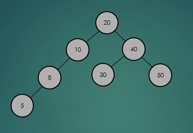
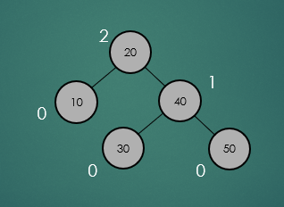
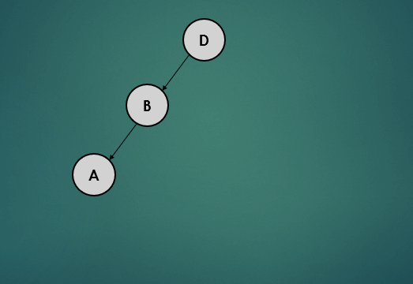
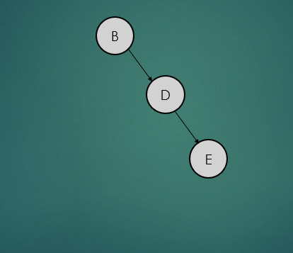
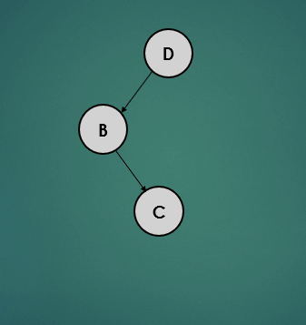
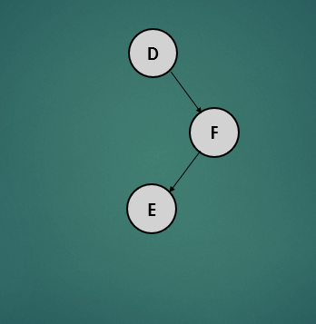

# AVL Tree
## 1. 정의 및 특징
- AVL 트리는 트리가 한쪽으로 치우쳐 자라나는 현상을 방지하여 트리 높이의 균형을 유지하는 이진탐색트리이다.
- Balanced 이진탐색트리를 만들면 N개의 노드를 가진 트리의 높이가 O(logN)이 되어 탐색, 삽입, 삭제 연산의 수행시간이 O(logN)이 보장된다.

### 1.1 Linked List, Binary Search Tree, Balanced Binary Tree 비교
#### Linked List
- 구현이 쉬움
- 많은 포인터(참조)를 저장
- O(N) 시간복잡도를 가짐
#### Binary Search Tree
- 탐색의 O(N) 시간복잡도를 O(logN) 시간복잡도로 줄임
- Unbalanced Tree일 경우 탐색의 속도는 느려짐 (최악의 경우 O(N))
#### Balanced Binary Tree(AVL Tree, Red-Black Tree)
- 균형을 이루도록 보장
- 항상 O(logN)의 시간복잡도를 보장

### 1.2 AVL Tree의 특성
- 이진탐색트리 연산 실행시간은 이진탐색트리의 높이에 따라 달라지는데 최상의 성능을 얻으려면 트리의 균형을 유지해야한다.
  - AVL 트리에서 노드의 두 하위 트리(왼쪽, 오른쪽)의 높이의 차이가 최대 1을 넘지 않는다.
- AVL 트리는 엄격하게 균형을 유지하기 때문에 Red-black 트리보다 더 빠른 성능을 가지지만 더 많은 작업을 수행해야만 한다.
  - 특히 운영체제의 경우 이러한 자료구조에 의존한다.
- 대부분의 연산은 이진탐색트리와 동일하다.
  - 이진탐색트리와 동일하게 모든 노드는 최대 2개의 자식노드를 가질수 있고, 왼쪽 자식노드는 부모 노드보다 작고, 오른쪽 자식노드는 크다.
  - 삽입 연산의 경우 이진탐색트리와 동일하지만 모든 삽입연산은 트리가 균형을 유지하는지 확인을 해야한다.
  - 삭제, 최대/최소값 반환 연산 또한 마찬가지이다.

## 2. 연산
### 2.1 연산의 시간복잡도
#### 이진탐색트리
||평균|최악|
|-----|-----|-----|
|공간|O(N)|O(N)|
|삽입|O(logN)|O(N)|
|삭제|O(logN)|O(N)|
|탐색|O(logN)|O(N)|
#### AVL 트리
||평균|최악|
|--|--|--|
|공간|O(N)|O(N)|
|삽입|O(logN)|O(logN)|
|삭제|O(logN)|O(logN)|
|탐색|O(logN)|O(logN)|

### 2.2 탐색
- AVL 트리의 탐색은 이진트리와 동일하다.
#### 2.2.1 특정 노드 탐색
<p align="center"></p>

#### 2.2.2 최소, 최댓값 탐색
<p align="center"></p>

<p align="center"></p>

### 2.3 높이
- AVL 트리 상에서는 연산을 수행하고 불균형이 발생하면 회전을 통해 균형을 다시 맞춘다.
- 이렇게 균형을 맞추기 위해서는 각 노드들의 높이를 알아야만 한다.
<p align="center"></p>

- __노드의 높이는 특정 노드부터 leaf 노드까지 가장 긴 경로의 길이를 말한다.__
```
height = max(leftChild.height(), rightChild.height()) + 1
```
- 특정 노드의 높이를 계산하는 방법은 위와 같은 코드를 통해 계산을 할 수 있다.
  - 특정 노드의 왼쪽, 오른쪽 자식노드의 높이 중에서 가장 큰 값을 1을 더한 값이 특정 노드의 높이가 된다.
  - leaf 노드는 null인 자식노드를 가지고 있는데 이런 경우 자식 노드의 높이는 -1로 간주한다.

### 2.4 회전
- AVL 트리에서 삽입, 삭제 연산을 수행할 때 트리의 균형을 유지하기 위해 LL, RR, LR, RL 회전 연산이 사용된다. 각 회전 연산은 두 종류의 기본적인 연산으로 구현된다.
- rightRotate()은 왼쪽 방향의 서브트리가 높아서 불균형이 발생할 때 서브트리를 오른쪽 방향으로 회전하기 위한 메서드이고, leftRotate()는 오른쪽 방향의 서브트리가 높아서 불균형이 발생했을 때 왼쪽 방향으로 회전하기 위한 메서드이다.

#### 불균형 상태 판별 계산식 
- 왼쪽, 오른쪽 하위트리의 높이 차이기 절대 값 1을 초과한 경우 불균형 상태이다.
```
| height(leftSubtree) - height(rightSubtree) | ≤ 1
```

#### 2.4.1 Case 1 : LL (왼쪽으로 트리가 치우침)
<p align="center"></p>

1. leaf 노드(A)는 자식노드가 없기 때문에 왼쪽, 오른쪽 자식노드를 -1로 간주하여 높이를 계산하면 0이고 균형상태이다.
2. 그 다음 노드인 B는 왼쪽 노드는 0, 오른쪽 노드는 null이기 때문에 -1로 높이를 계산하면 1이고 균형상태이다.
3. 루트 노드인 D는 왼쪽노드는 1, 오른쪽 노드는 null이기 때문에 -1로 높이를 계산하면 2이고 하위 트리의 높이 차이가 1을 초과하기 때문에 불균형 상태이다.
4. 왼쪽으로 치우친 트리의 균형을 잡기 위해 오른쪽으로 회전을 수행한다.


#### 2.4.2 Case 2 : RR (오른쪽으로 트리가 치우침)
<p align="center"></p>

1. leaf 노드(E)는 자식노드가 없기 때문에 왼쪽, 오른쪽 자식노드는 -1로 간주하여 높이를 계산하면 0이고 균형상태이다.
2. 그 다음 노드인 D는 왼쪽 노드는 null이기때문에 -1, 오른쪽 노드는 0이기떄문에 높이를 계산하면 1이고 균형상태이다.
3. 루트 노드인 F는 왼쪽 노드는 null이기 때문에 -1, 오른쪽 노드는 1로 높이를 계산하면 2이고 하위트리의 높이 차이가 1을 초과하기 때문에 불균형 상태이다.
4. 오른쪽으로 치우친 트리의 균형을 잡기 위해 왼쪽으로 회전을 수행한다.


#### 2.4.3 Case 3 : LR (왼쪽 자식 노드에 오른쪽 자식 노드만 있음)
<p align="center"></p>

1. leaf 노드(C)는 자식 노드가 없기 때문에 왼쪽, 오른쪽 자식노드를 -1로 간주하여 높이를 계산하면 0이 되고, 균형상태이다.
2. 노드 B는 왼쪽 자식노드는 null이기 때문에 -1, 오른쪽 자식 노드는 0으로 높이를 계산하면 1이 되고, 균형상태이다.
3. 루트 노드인 노드 D는 왼쪽 자식노드는 1, 오른쪽 자식노드는 null이기 때문에 -1로 높이를 계산하면 2이기 때문에 불균형 상태이다.
4. 노드 B를 왼쪽으로 회전시킨다.
5. 이렇게 되면 왼쪽으로 치우친 트리의 형태가 되는데 루트 노드인 D를 오른쪽으로 회전 시킨다.

#### 2.4.4 Case 4 : RL (오른쪽 자식 노드에 왼쪽 자식 노드만 있음)
<p align="center"></p>

1. leaf 노드(E)는 자식 노드가 없기 때문에 왼쪽, 오른쪽 자식노드를 -1로 간주하여 높이를 계산하면 0이 되고, 균형상태이다.
2. 노드 F의 왼쪽 자식노드는 1, 오른쪽 자식 노드는 null이기 때문에 -1로 높이를 계산하면 1이 되고, 균형상태이다.
3. 루트 노드인 노드 D는 왼쪽 자식노드가 null이기때문에 -1, 오른쪽 자식노드 1로 높이를 계산하면 2이기 때문에 불균형 상태이다.
4. 노드 F를 오른쪽으로 회전시킨다.
5. 이렇게 되면 오른쪽으로 치우친 트리의 형태가 되는데 루트 노드인 D를 왼쪽으로 회전 시킨다.

### 2.5 삽입
- AVL 트리의 삽입연산은 2단계로 수행된다.
  - 1단계에서는 이진탐색트리와 동일하게 삽입연산을 수행한다.
  - 2단계에서는 새로 삽입된 노드로부터 루트 노트로 거슬러 올라가며 각 노드의 높이를 갱신한다. 이때 불균형이 발생한 노드를 발견하면 새 노드가 어디에 삽입되었는가에 따라 회전연산을 수행한다.

1. 이진탐색 트리와 동일하게 삽입연산을 수행한다.
2. 삽입연산이 완료되면 삽입한 노드부터 루트 노드까지 높이 계산을 수행하고, 불균형이 발생하면 회전을 수행한다.
3. 회전이 끝나고 트리 모든 노드의 높이의 계산을 다시 수행하여, 불균형을 발견하면 회전연산을 다시 수행하고, 더 이상 불균형이 없으면 연산을 종료한다.

### 2.6 삭제
- AVL 삭제 연산 또한 마찬가지로 2단계로 수행된다.
  - 1단계에서는 이진탐색트리와 동일하게 삭제연산을 수행한다.
  - 2단계에서는 삭제된 노드로부터 루트 노드 방향으로 거슬러 올라가면서 불균형이 발생한 경우 회전연산을 수행한다.
- 이진탐색 트리와 동일하게 AVL 트리의 삭제 연산은 아래와 같이 3개의 경우의 수가 존재한다.

```
1) 삭제할 노드가 leaf 노드인 경우
2) 삭제할 노드가 한 개의 자식 노드를 가진 경우
3) 삭제할 노드가 두 개의 자식 노드를 가진 경우
```

#### 2.6.1 삭제할 노드가 leaf 노드인 경우
- 제거할 노드가 leaf 노드일 경우는 간단하게 제거하기만 하면 된다.

#### 2.6.2 삭제할 노드가 한 개의 자식 노드를 가진 경우
- 제거할 노드가 하나의 자식 노드를 가진 경우는 참조값을 변경하기만 하면 된다.

#### 2.6.3 삭제할 노드가 두 개의 자식 노드를 가진 경우
- 제거할 노드가 2개의 자식 노드를 가진 경우 왼쪽 하위 트리에서 가장 큰 항목 또는 오른쪽 하위 트리에서 가장 작은 항목을 찾아 서로의 위치를 바꾸고, 노드를 제거한다.

#### 2.6.4 노드를 삭제한 뒤 트리가 불균형일 때
- 노드를 삭제한 뒤 트리가 불균형인지 확인한 뒤 불균형 상태라면 회전연산을 수행한다.

## 3. 구현
- src 참조.


