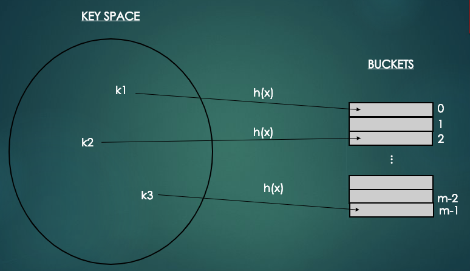
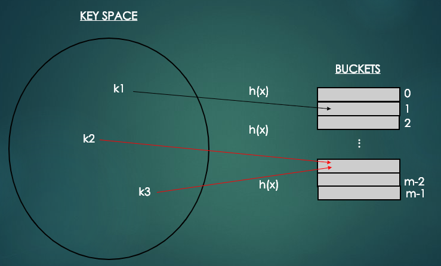
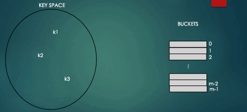
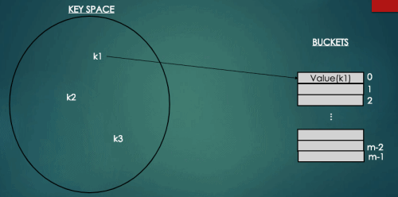

# Hashtable (해시테이블)
## 1. 정의 및 특성
- O(logN)보다 빠른 연산을 위해 키와 1차원 배열의 인덱스의 관계를 이용하여 키(항목)를 저장하는 자료구조를 해시테이블이라고 한다.
- 해시테이블은 키를 간단한 해시함수로 계산한 값을 배열의 인덱스로 이용하여 항목을 저장하고 탐색/삭제하는 연산을 평균 O(1) 시간복잡도로 지원하는 자료구조이다.

- 일반적으로 배열에 회원을 저장하거나 특정 회원을 탐색하는 상황을 생각해보자.
  - 배열의 인덱스를 통한 삽입이나 탐색 연산은 O(1) 시간복잡도를 가지게 된다.
- 하지만 해시테이블의 경우 배열의 인덱스를 키값으로 가지고 있는 것이 아니라 회원의 이메일을 키값으로 가지고 있다.
  - 따라서, 키값을 해시함수를 통해 배열의 인덱스로 변환하는 과정을 거치야 한다.

```java
index = h(key) // h()는 해시함수를 의미하고, 배열의 인덱스에 키를 매핑한다.
```

<p align="center"></p>

- 해시함수는 키들을 균등하게 해시테이블의 인덱스로 변환하기 위해 의미가 부여되어 있는 키를 간단한 계산을 통해 해시테이블 크기에 맞게 해시값을 계산한다.
```
n : 키의 숫자를 의미
m : 배열의 버킷 수 또는 크기(사이즈)를 의미
h(x) = n % m    :    나머지 연산 = 해시함수로 대표적
```
- 해시함수가 균등한 결과를 보장하더라도 함수 계산 자체에 긴 시간이 소요되면 해싱의 장점인 연산의 신속성을 잃게 된다.
- 따라서, 단순하면서도 동시에 키들을 균등하게 변환하는 해시함수가 바람직하다.

## 2. Collision (충돌, 해시 충돌)
<p align="center"></p>

- 위의 그림과 같이 서로 다른 키값에 대해서 해싱함수에 의해 주어진 버킷이 같은 경우를 충돌(Collision)이라고 한다.

### 2.1 Closed Addressing (폐쇄 주소 방식) - Chaining
<p align="center"></p>

- 폐쇄 주소 방식은 키에 대한 해시값에 대응되는 곳에만 키를 저장한다. 따라서 충돌이 발생한 키들은 한 위치에 모여 저장되는데 이를 구현하는 대표적인 방법이 __체이닝(Chaining)__ 이다.
- 체이닝은 키를 해시값에 대응되는 연결리스트에 저장하는 해시방식으로 연결리스트로 구현되어 참조값을 차지하는 공간이 추가로 필요하다는 단점이 있다.
- 하지만 개방 주소 방식과는 달리 empty 원소를 찾는 오버헤드와 군집화가 없으며 구현이 간결하여 실제로 가장 많이 활용되는 방식이다.

### 2.2 Open Addressing (개방 주소 방식)
<p align="center"></p>

- 개방 주소 방식은 해시테이블 전체를 열린 공간으로 가정하여 충돌한 키를 일정한 방식에 따라 찾아낸 empty 공간에 저장한다.
- 대표적인 방법은 선형조사(Linear Probing)와 이차조사(Quadratic Probing), 랜덤조사(Random probing) 등이 있다.

#### 선형조사 (Linear Probing)
- 선형조사는 충돌이 일어난 원소에서부터 순차적으로 검색하여 처음 발견한 empty 원소에 충돌이 일어난 키를 저장한다.
  - 즉 h(x) = i라면 해시테이블에 a[i], a[i+1], a[i+2], ... ,a[i+j]를 차례로 검색하여 첫 번째로 찾아낸 empty 원소에 키를 저장하는 방식이다.
- 선형조사는 순차탐색으로 empty 원소를 찾아 충돌된 키를 저장하므로 해시테이블의 키들이 빈틈없이 뭉쳐지는 현상이 발생한다.
  - 이를 __군칩화(Primary Clustering)__ 이라고 하는데 탐색, 삽입, 삭제 연산시 군집된 키들을 순차적으로 방문해야하는 문제점을 일으킨다.
  - 이러한 군집화는 해시테이블에 empty원소 수가 적을수록 더 심화되며 해시성능을 저하시킨다.


## 3. 동적 해싱 (Dynamic Resizing)
- 해시테이블에 비어있는 원소가 적으면, 삽입에 실패하거나 해시성능이 급격히 적어지는 현상이 발생한다. 성능은 적재율(Load Factor)에 따라 달라진다.

### 적재율 (Load Factor)
- 적재율이란 N(테이블에 저장된 키의 수) / N(테이블의 크기)이다.
- 적재율은 1과 가까워질수록 해시테이블은 거의 다 차있어 성능이 낮아지게 되고, 연산이 느려지게 된다.
- 적재율이 0과 가까워질수록 해시테이블은 거의 비어있어 메모리를 낭비하게 된다.
- 적재율을 a라고 한다면 일반적으로 a >= 0.75가 되면 해시테이블의 크기를 2배로, a <= 0.25가 되면 해시테이블을 1/2로 줄인다.

## 4. HashTable 구현
- src 참조.

