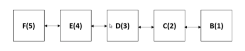

# Least Recently Used Cache
## 1. 정의
- 캐시는 데이터나 값을 미리 복사해 놓는 임시 장소를 가리킨다.
- 캐시는 접근 시간에 비해 원래 데이터를 접근하는 시간이 오래 걸리는 경우나 값을 다시 계산하는 시간을 절약하고 싶은 경우 사용한다.
- 캐시에 데이터를 미리 복사해 놓으면 계산이나 접근 시간 없이 더 빠른 속도로 데이터에 접근할 수 있다.

## 2. 기본 원리
- LRU는 OS의 페이지 교체 알고리즘의 하나로 최근에 가장 오랫동안 사용하지 않은 페이지를 교체하는 기법이다.
- 캐시에 공간이 부족하면 가장 최근에 사용하지 않은 항목을 제거한다.

## 3. LRU Cache 구현
- LRU Cache 구현은 Doubly Linked List를 통해 구현한다.
- head에 가까운 데이터일수록 최근에 사용한 데이터이고, tail에 가까울수록 가장 오랫동안 사용하지 않은 데이터로 간주하여 새로운 데이터를 삽입할 때 가장 먼저 삭제되도록 한다.

